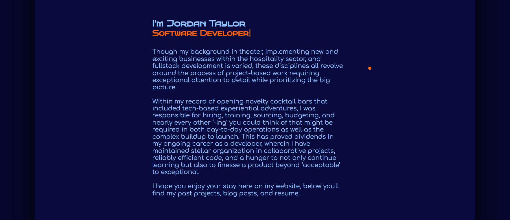

# My Portfolio

Portfolio website built in React

This was a website built to showcase my design and technical skills with HTML, CSS, React, as well as some packages.

## Table of Contents

- [Overview](#overview)
- [Built With](#built-with)
- [Features](#features)
- [Contact](#contact)

## Overview

 [Link to site] - (https://main--jordan-taylor-portfolio.netlify.app/)

 I built this project as hub to display my projects and technical skillsets. My main focus during development was to expand my knowledge of CSS and to better understand its strengths and weaknesses (media queries, flexbox, accessibility practices).

### Built With

* HTML
* CSS
* JavaScript
* Axios
* Git
* GitHub
* React
* [Mouse Follower](https://github.com/Cuberto/mouse-follower)
* [Typewriter](https://www.npmjs.com/package/typewriter-effect)
* [React Lottie](https://www.npmjs.com/package/react-lottie)

## Features

### Header
Bespoke sun and planet designs functioning as a navbar
Implementation and customisation of the Cuberto Mouse Follower JS package
Brief intro
Links to my LinkedIn and Github profiles

    

   Display profile image when hovering over my name using Mouse Follower
   

### Introduction
Implementation and customisation of an React typewriter package
Further customisation of the Mouse Follower package
A personal introduction. 

### Porjects
Responsive design and animation
Further customisation of the Mouse Follower package
Descriptions and links to other projects

### Medium Blog Posts
Carousel using pure HTML and CSS
Using Axios to retrieve my Medium blog posts
API call fetches the following data from Meduim:
* Title
* First 500 words of post
* Image 
* links

### Footer
Implementation and customisation of an React Lottie package
Links to my LinkedIn and Github
Secondary planetary navbar 

## Contact

[LinkedIn](https://www.linkedin.com/in/jordan-taylor-903471242/)
[GitHub](https://github.com/JordanJamesTaylor)
